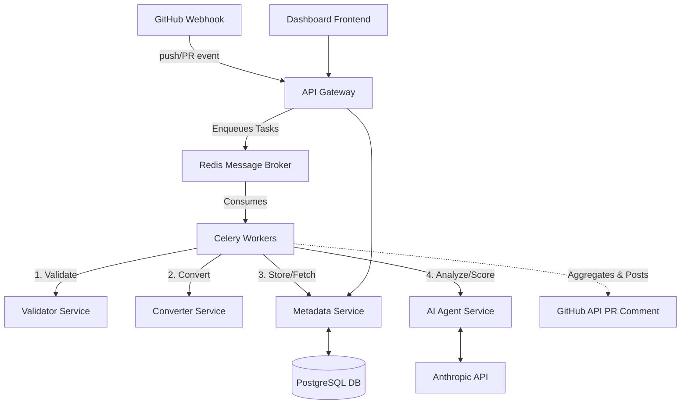

# CADFlow Architecture

## System Diagram

## Microservices

### 1. Validator Service
**Stack**: FastAPI, Python, ezdxf
**Responsibility**: Takes a `.dxf` file and validates engineering rules (e.g., minimum wall thickness). Extracts metadata such as layers and entity counts.

### 2. Converter Service
**Stack**: FastAPI, Python, ezdxf, ezdxf addons
**Responsibility**: Converts `.dxf` formats into structured JSON metadata or SVG formats for preview.

### 3. Metadata Service
**Stack**: FastAPI, Python, SQLAlchemy, PostgreSQL, Alembic
**Responsibility**: Maintains the core data model. Stores file versions, extracted metadata, and the audit trail of approvals and validation results.

### 4. AI Agent Service
**Stack**: FastAPI, Python, Anthropic SDK, scikit-learn
**Responsibility**: Computes a risk score for a CAD change using an Isolation Forest anomaly detection model. Uses the Anthropic API to generate a plain English summary of the differences between the current and previous CAD file versions.

### 5. API Gateway & Task Orchestrator
**Stack**: FastAPI, Celery, Redis
**Responsibility**: Acts as the ingress for GitHub Webhooks. Pushes events onto the Redis queue. Celery workers execute the sequence of API calls to the downstream microservices and ultimately post the final review comment back to the GitHub PR.

### 6. Dashboard
**Stack**: FastAPI, HTML/JS
**Responsibility**: A lightweight frontend to view the immutable audit log and the status of recent CAD changes.
